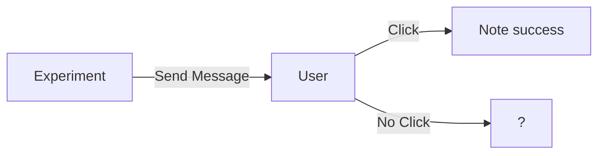
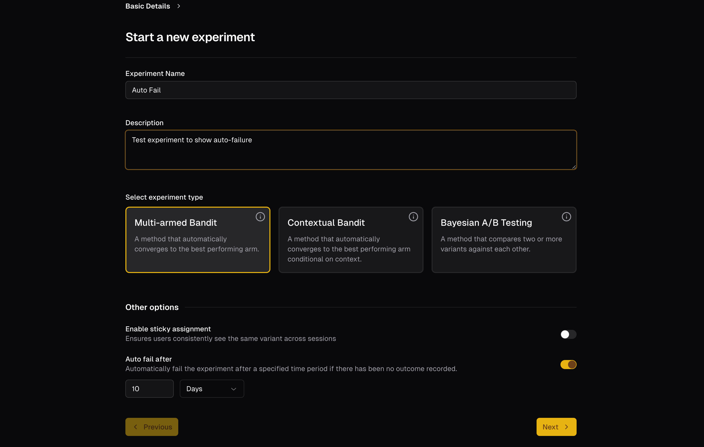

---
authors:
  - Sid
category:
  - Experiments
  - A/B
  - MAB
  - CMAB
date: 2025-04-29
---
# Auto fail draws

We rolled out a new feature where your experiment draw is marked as failure if a certain amount of time expires without a response.

<!-- more -->

Imagine you are running an experiment to test a new kind of message and the outcome you are capturing is if the user clicked on a link.

When the user clicks on the link, you are able to capture the success case. However, you are not capturing the failure case (user did not click).

This leads to a situation where you have a lot of positive cases (user clicked) and no negative cases (user did not click) and it leads to a bias in the model. This might show up as the model converging too quickly to a possibly suboptimal solution.

## Set auto fail for your Experiment

When creating a new experiment, you can now turn on "Auto fail after" and set a time limit. If the user does not respond within that time limit, the experiment will be marked as a failure.

## Up next

The proper way we'd want to handle this is by using survival analysis models. We've added that to the roadmap and hope to have it ready soon!
