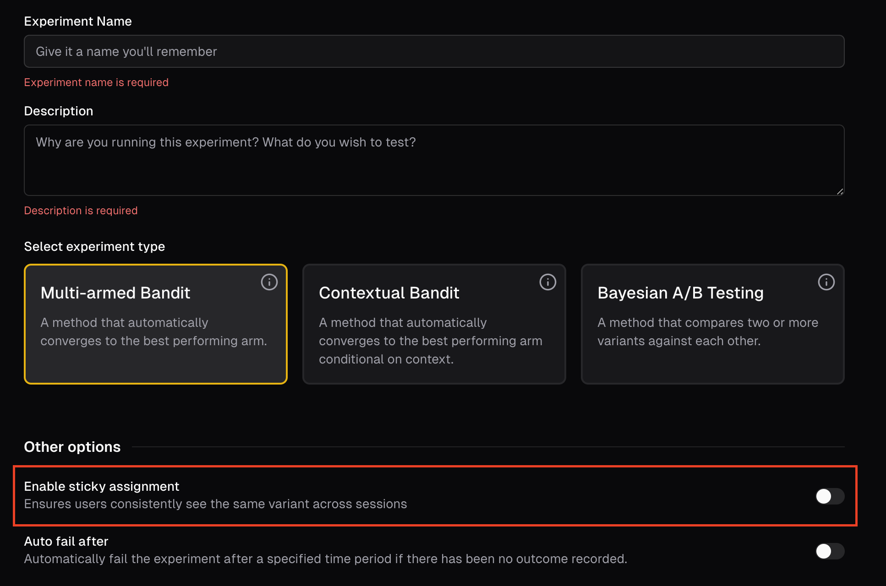
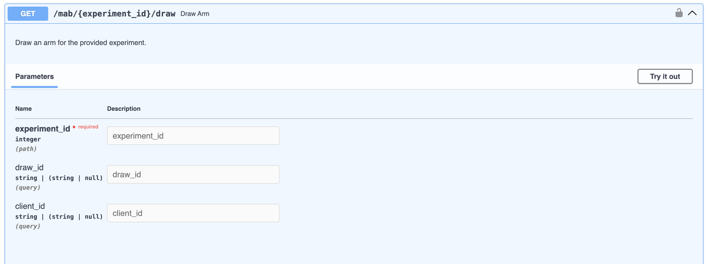

---
authors:
  - Poornima
category:
  - Experiment
  - UI/UX
date: 2025-05-01
---
#
You can now draw arms with "sticky assignment" i.e. the same user gets the same arm throughout the experiment.

<!-- more -->

Typically, we would randomly assign arms every time we draw an arm for a user. However, we now track whether there are repeat users, and ensure that the same user always sees the same arm.

You can optionally turn on this feature when you configure the basic information for the experiment

If sticky assignments are enabled, you also need to provide a unique `client_id` for each user when you call the `draw_arm` endpoint.

