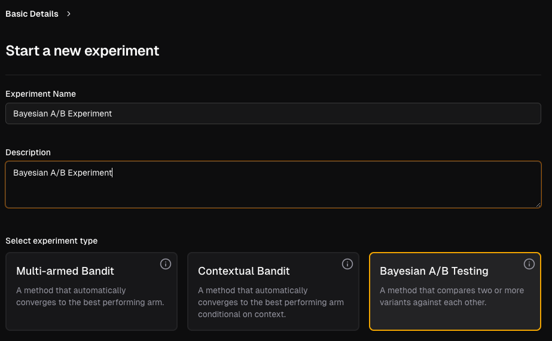
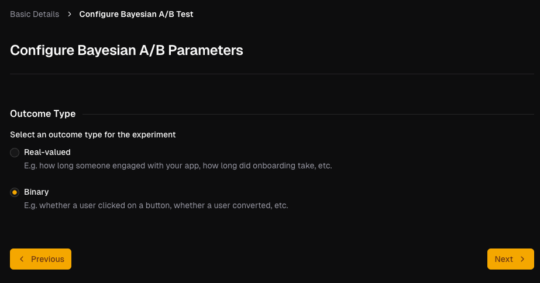
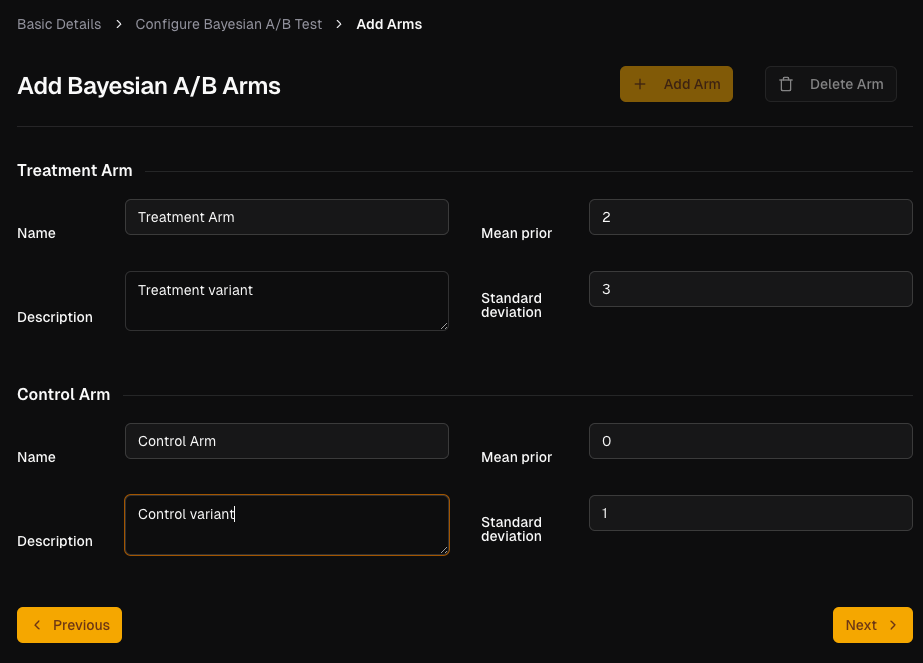

# Setting up a Bayesian A/B Experiment

Once you've logged in and chosen to create new experiment from the landing page (see [this guide](../../first-experiment/create.md)), here's how to set up your Bayesian A/B experiment.

## Fill out the experiment details

Enter the details for the experiment. Both `Experiment Name` field and `Description` are mandatory. Select `Bayesian A/B Testing` as the experiment type.

Click on the `Next` button to proceed.

## Choose your prior and outcome type

Choose the outcome type: either binary or real-valued.

Click on the `Next` button to proceed.

## Create experiment arms

Currently, you can have exactly 2 arms for the A/B test: a treatment and control arm.

Enter details for each arm. The `Name` and `Description` fields are both mandatory.

The priors are defined through the `Mean` and `Standard Deviation` parameters of the Gaussian distributions: the default values are `0` and `1` respectively.

Click on the `Next` button to proceed.

Once you've set up notfications and created the experiment, you can now run the experiment with your users, in the [same way as you would for MABs](../mabs/run-experiment.md).
