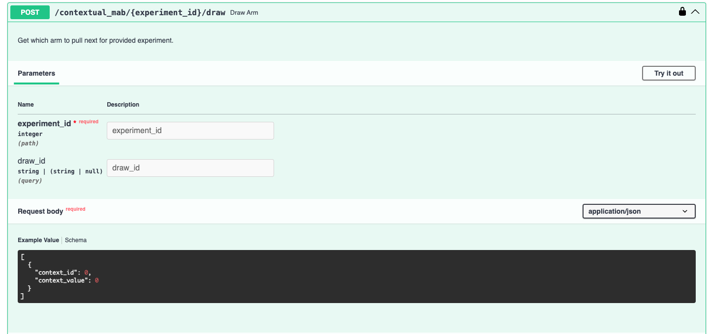
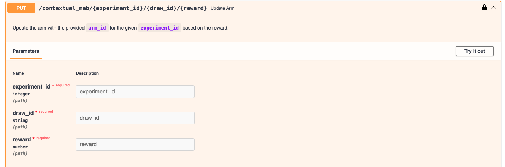

# Running a CMAB experiment

Once the experiment is set up, you have a unique `experiment_id` assigned to it.
You can now use this experiment ID to randomly choose an arm or variant to present to each new end-user by calling the `draw_arm` endpoint.

This works similarly to the `draw_arm` [endpoint for MABs](../mabs/run-experiment.md), but crucially require the context to be input in addition to the `experiment_id`. You can also optionally input a unique `draw_id`, or the system will autogenerate one.

You can then use this ID to record the outcome of presenting the arm you drew to the user, using the `update_arm` endpoint, similarly to how it works with MABs.

We're currently working on visuals for an experiment card corresponding to CMABs and on a dashboard to display more detailed information across experiments.
