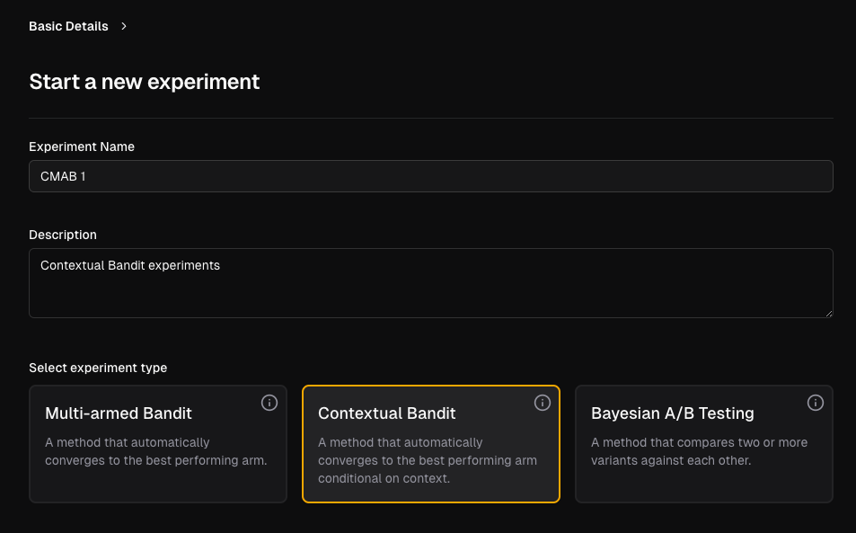
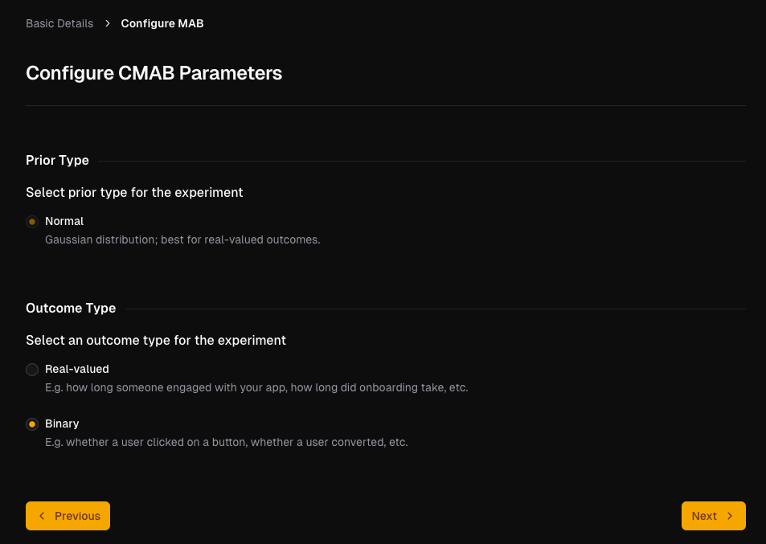
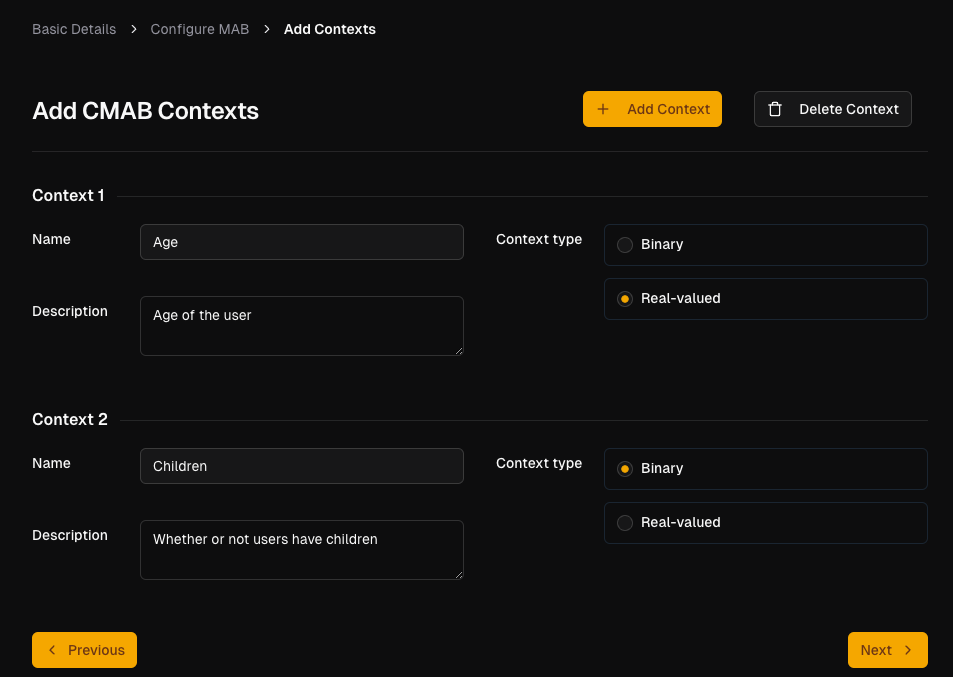
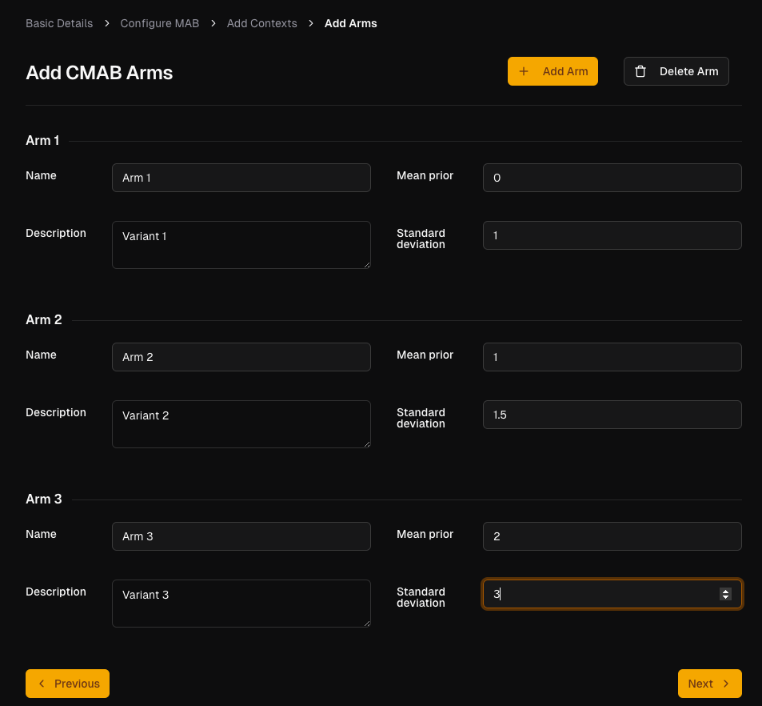

# Setting up a Contextual Bandit

Once you've logged in and chosen to create new experiment from the landing page (see [this guide](../../first-experiment/create.md)), here's how to set up your CMAB.

## Fill out the experiment details

Enter the details for the experiment. Both `Experiment Name` field and `Description` are mandatory. Select `Contextual Bandit` as the experiment type.

Click on the `Next` button to proceed.

## Choose your prior and outcome type

Choose the outcome type: binary or real-valued (the prior is fixed to a normal distribution).

Click on the `Next` button to proceed.

## Configure user context

Enter the user information that you want to track for the experiment. Each context corresponds to one "feature" of the user. The `Name` and `Description` fields are mandatory, and the context value can either be real-valued (e.g. age) or binary (e.g.
whether or not a user has children).

Then click `Next` to proceed.

## Create experiment arms

Click on the `+ Add Arm` button to add arms to the experiment. You can add as many arms as you like but must have a minimum of 2 arms.

Enter details for each arm. The `Name` and `Description` fields are both mandatory.

The priors are defined through the `Mean` and `Standard Deviation` parameters of the Gaussian distributions: the default values are `0` and `1` respectively.

Click on the `Next` button to proceed.

Once you've set up notfications and created the experiment, you can now [run the experiment](./run-experiment.md) with your users.
