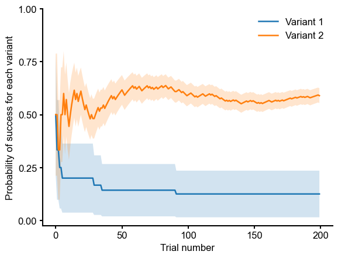

# Multi-Armed Bandits

Multi-armed Bandits (MABs) are useful for running experiments where you have multiple variants of a feature / implementation that you want to test, and want to automatically converge to the variant that produces the best results.

## What are Multi-Armed Bandits (MABs)?

MABs are a specialized reinforcement learning algorithm: let's imagine that you have set up $N$ variants of an experiment, and for each variant you some prior probability of a desired result. You serve your each of your users one of these variants (the strategy for choosing the variant is based on the prior probabilities), and observe the result of their interaction with it: for example, if you are experimenting with a website interface, you might want to track when a user returns to a page, clicks on a link, etc..

Once you have observed the result, the algorithm updates your arm / variant's probability of achieving the desired result. The next time you serve a user one of the variants, the experiments engine uses these updated probabilities to determine which variant to show them.

Since we update the probabilities for the variants with every result observation, at any given time you can observe the updated probability of success for every arm. The best-performing variant at the end of the experiment is the one with the highest probability. For example, in the plot below variant 2 is the best-performing one at the end of 200 observations.

## Show me some math!

In our current implementation of MABs, we support the following configurations of priors and outcome distributions:

| Prior | Outcome | Update algorithm |
|-------|---------|----------|
| Beta | Binary (Bernoulli distribution) | Thompson sampling |
| Gaussian | Real-valued (Gaussian distribution) | Thompson sampling |

### Beta-binomial bandits
Given $N$ variants of a feature or implementation, if we assume that the observed result $y$ of these experiments is binary-valued, we can model the result likelihood as follows:
$$
\begin{equation}
y \sim \text{Bernoulli} (\theta_i)
\end{equation}
$$
where $\theta_i$ denotes the binomial probability of the outcome $y$ under variant $i (= 1, \ldots .N)$

We also assume Beta priors for $\theta_i$:
$$
\begin{equation}
\theta_i \sim \text{Beta} (\alpha_i, \beta_i)
\end{equation}
$$
We require users to set $\alpha_i$ and $\beta_i$ parameters for each variant, _before_ the experiment begins. The mean of the distribution is $\frac{\alpha_i}{\alpha_i + \beta_i$} -- this means that a larger value of $\alpha_{\cdot}$ corresponds to a higher probability of success, and $\beta_{\cdot}$ is inversely proportional to the probability of success.

During the course of the experiment, we choose the variant $j$ to present to the user using Thompson sampling:
$$
\begin{equation}
j = \text{argmax}\ \[ \theta_i \]^N_{i = 1}
\end{equation}
$$

Finally, once we have observed an outcome $y$ for a given variant, we can obtain the posterior distribution for that variant. Since the beta and
binomial distributions are conjugate, this is a relatively straightfoward update: i.e. given an observation $y$,
$$
\begin{equation}
  \theta^{(\text{post})}_i \sim \text{Beta} (\alpha_i + y, \beta_i + (1 - y))
\end{equation}
$$
This then becomes the new prior from which we sample variants while choosing arms / variants.

### Gaussian priors and real-valued outcomes

With real-valued outcomes and Gaussian priors, the likelihood becomes:
$$
\begin{equation}
  y \sim \mathcal{N} (\theta_i, \sigma^2)
\end{equation}
$$

In our current implementation we set $\sigma = 1$. The corresponding priors for each variant are:
$$
\begin{equation}
  \theta_i \sim \mathcal{N} (\mu_i, \sigma^2_i)
\end{equation}
$$

Thompson sampling proceeds similar to Eqn (3) and the posterior update given an observation $y$ is as follows:
$$
  {\sigma }^{(\text{post})}_i = \frac{1}{\sqrt{\frac{1}{\sigma^2_i} + \frac{1}{\sigma^2}}}
$$
$$
  \mu^{(\text{post})}_i = \frac{\frac{\mu_i}{\sigma_i^2} + \frac{y}{\sigma^2}}{\frac{1}{\sigma^2_i} + \frac{1}{\sigma^2}}
$$
$$
\begin{equation}
  \theta^{(\text{post})}_i \sim N (\mu^{(\text{post})}_i, (\sigma^{(\text{post})}_i)^2)
\end{equation}
$$

Now, you can [set up the MAB](./setting-up.md), and configure the priors for the variants and outcomes.

### Additional Resources
You can learn more about multi-armed bandits from the following resources:

1. [Multi-armed Bandits with Thompson Sampling](https://www.youtube.com/watch?v=TdjOAfk7iVA)

2. [Reinforcement Learning: An Introduction, Sutton and Barto, Chapter 2](http://www.incompleteideas.net/book/RLbook2020.pdf)
