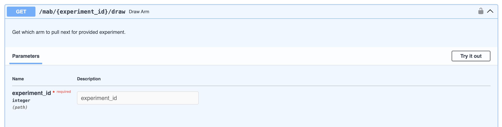
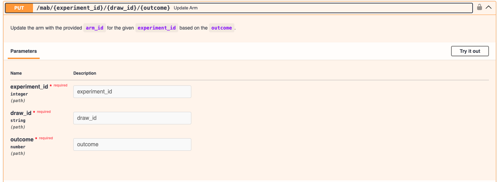
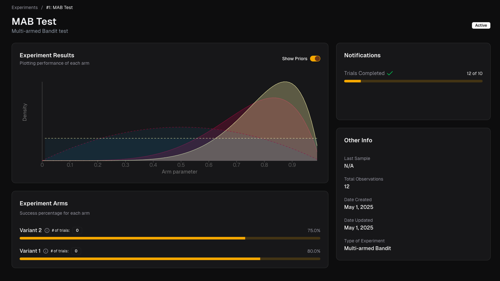
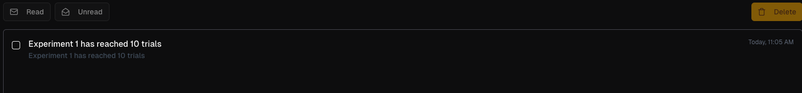

# Running a MAB experiment

Once the experiment is set up, you have a unique `experiment_id` assigned to it.
You can now use this experiment ID to randomly choose an arm or variant to present to each new end-user by calling the `draw_arm` endpoint.

You can either input a unique `draw_id` or the endpoint generates one for you.

You can then use this ID to record the outcome of presenting the arm you drew to the user, using the `update_arm` endpoint.

The `update_arm` endpoint updates the prior probability of the corresponding arm based on the observed outcome.

As you observe more and more outcomes, you can track the experiment's progress using Experiment Cards and the notfications.

We're also working on a dashboard to display more detailed information across experiments!
