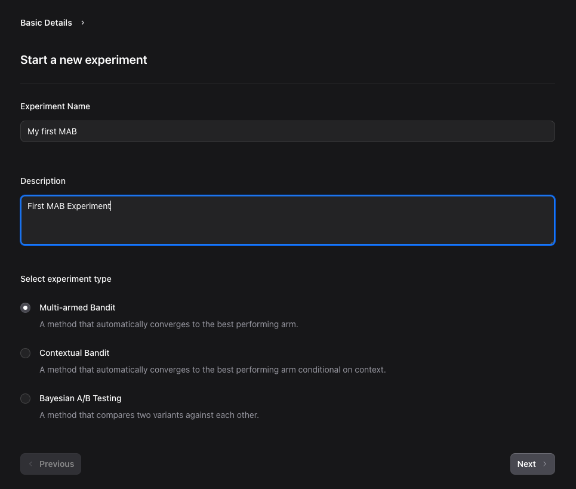
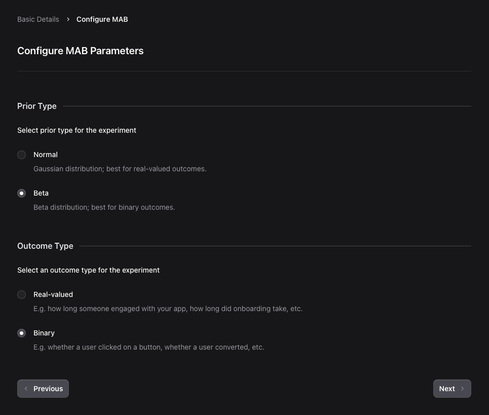
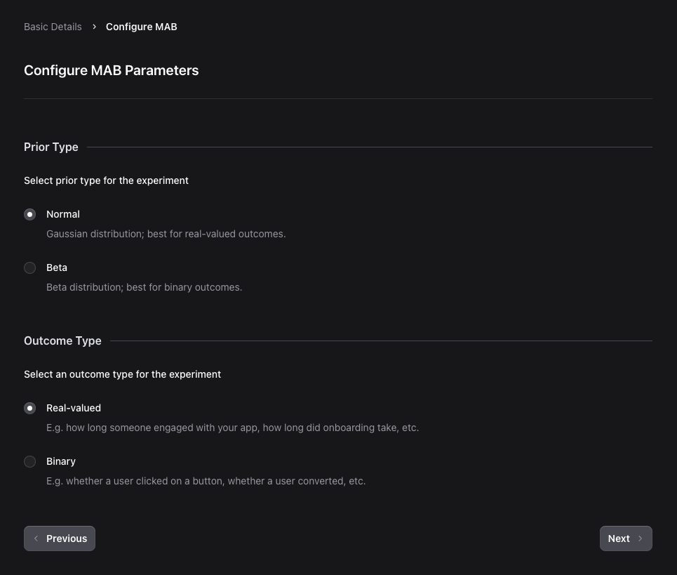
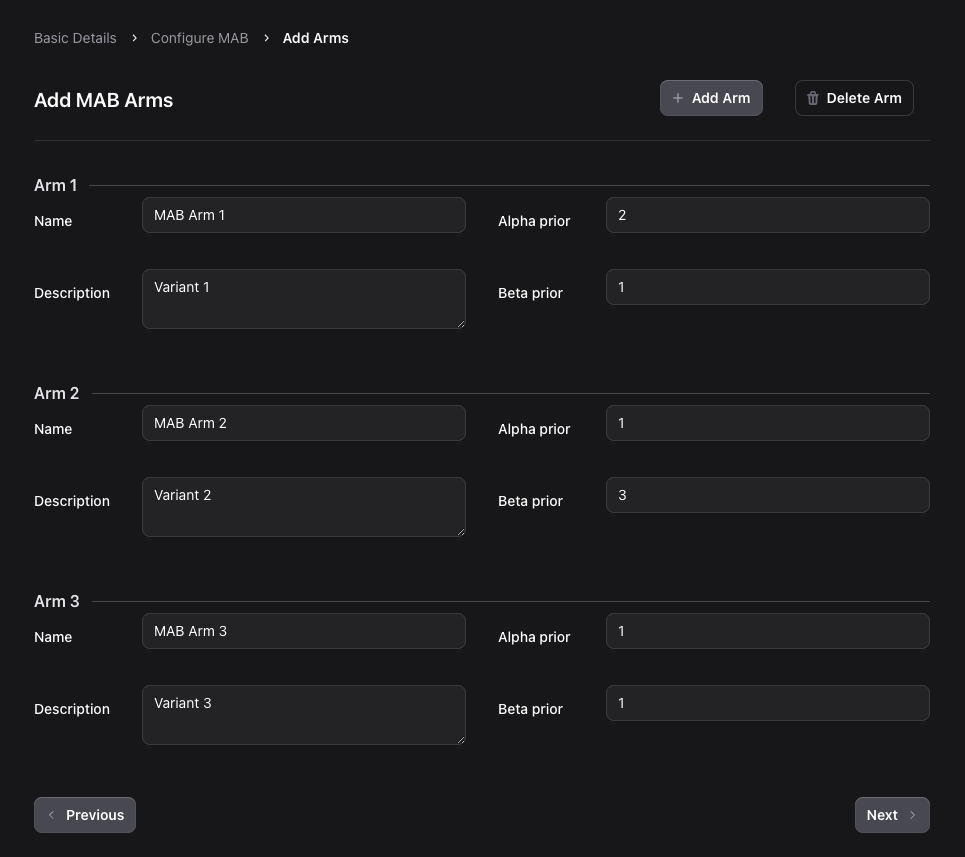
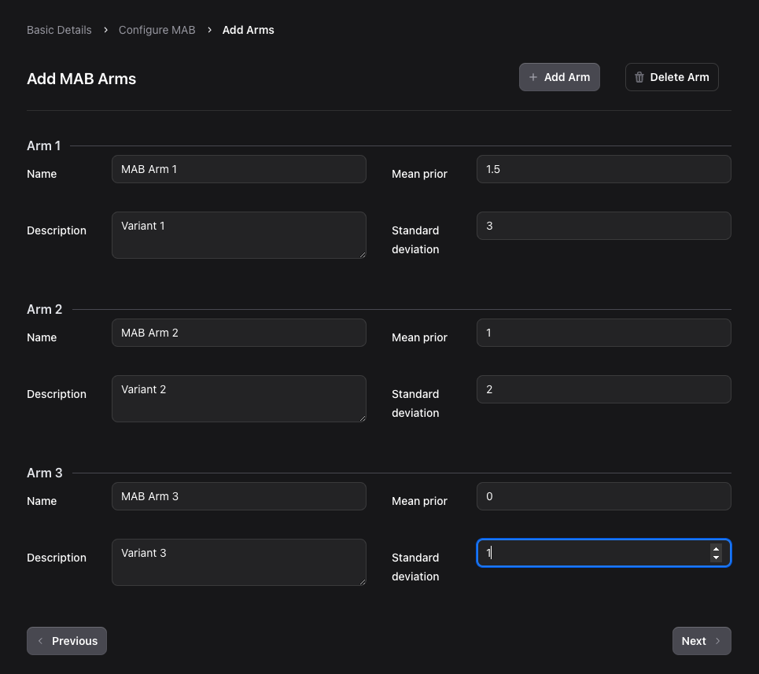

# Setting up a Multi-Armed Bandit

Once you've logged in and chosen to create new experiment from the landing page (see [this guide](../../first-experiment/create.md)), here's how to set up your MAB.

## Fill out the experiment details

Enter the details for the experiment. Both `Experiment Name` field and `Description` are mandatory. Select `MAB` as the experiment type.

Click on the `Next` button to proceed.

## Choose your prior and outcome type

Choose the prior distribution and the corresponding outcome. Currently, we only support conjugate distributions, this means that the allowed prior-outcome combos are "Beta" / "Binary" and "Normal" / "Real-valued".

Click on the `Next` button to proceed.

## Create experiment arms

Click on the `+ Add Arm` button to add arms to the experiment. You can add as many arms as you like but must have a minimum of 2 arms.

Enter details for each arm. The `Name` and `Description` fields are both mandatory.

If you chose the Beta prior for the arms, the priors are defined through the `alpha` and `beta` parameters of the Beta distribution: the default values are `1` and `1` respectively. The higher the `alpha` value, the more certain your prior on the arm achieving "success", while the reverse is true for the `beta` parameter[^1].

[^1] We know this is unintuitive for non-statisticians -- we're working on visual for configuring priors!

Similarly, for the Normal prior for the arms, the priors are defined through the `mean` and `standard deviation` parameters of the Gaussian distributions: the default values are `0` and `1` respectively. A higher `mean` value indicates a higher expected outcome for the corresponding arm, while a higher `standard deviation` indicates higher variability in the outcome for this arm.

Click on the `Next` button to proceed.

Once you've set up notfications and created the experiment, you can now [run the experiment](./run-experiment.md) with your users.
